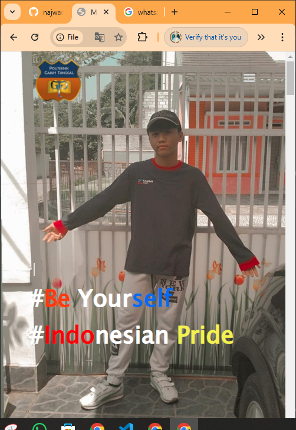

# English Version Language
## Website-Personal
This was my first web portfolio im using this to create my future plan to start my new project and to make myself more interested
And also this website is already responsive so you could possibly check on your other device to see the difference, But still i have many bug features on this.
I still need to learn more about how to make a perfect website in any different categories

what do i use in this web is : 
1. HTML
2. CSS
3. Java Script
4. @MediaQuery
5. Library Java Script
6. Hosting with Github Pages
7. Git features
8. Responsive Web Design in any platform (perhaps...)
9. Open source
10. Free use 4 anything that you want.

And my video reference to create this website is >>>> https://youtu.be/0YFrGy_mzjY?si=cYhl7Cp7bEkUZS0H
his channel youtube >>>> https://youtube.com/@greatstackdev?si=26XO3Zlhv5JfqbWN

Here's the link for my website that has been hosting using github pages : 
https://najwancaesar.github.io/Website-Personal/

## Preview in mobile mode
[](https://najwancaesar.github.io/Website-Personal/)

## Preview in desktop mode
[](https://najwancaesar.github.io/Website-Personal/)

# Indonesian Version Language

## Website Portofolio

Website ini merupakan sebuah portofolio pribadi yang berisi berbagai informasi, galeri foto, dan fitur interaktif lainnya. Website ini dirancang untuk menampilkan karya, pengalaman, serta profil secara profesional.

## Fitur Utama

1. **Halaman Utama**:

   - Menampilkan informasi singkat tentang pemilik portofolio.
   - Tautan navigasi ke berbagai halaman lain.

2. **Galeri Foto**:

   - Halaman khusus yang menampilkan koleksi foto dalam galeri.
   - Folder terkait: `Galeri-Photo/`.

3. **Dashboard Mini**:

   - Menyediakan fitur seperti jadwal kuliah, login, dan profil pengguna.
   - Folder terkait: `Mini dashboard/`.

4. **Audio Player**:

   - Latar musik atau efek suara menggunakan file audio seperti `music-background.mp3` dan `Spirit.wav`.

5. **Responsive Design**:

   - Website dapat menyesuaikan tampilannya di berbagai perangkat (jika didukung oleh CSS).

## Struktur Folder

Berikut adalah struktur folder utama dalam proyek ini:

- `Galeri-Photo/`:

  - Menyimpan file HTML, CSS, dan gambar untuk halaman galeri foto.
  - Contoh file: `galeri.html`, `photo1.jpg`.

- `Mini dashboard/`:

  - Menyimpan file HTML dan CSS untuk dashboard mini.
  - Contoh file: `dashboard.html`, `login.html`, `profile.css`.

- `my-images/`:

  - Menyimpan gambar dekorasi dan ikon yang digunakan di berbagai halaman.
  - Contoh file: `github2.png`, `stars.jpg`.

- `audio/`:

  - Menyimpan file audio untuk efek suara atau latar musik.
  - Contoh file: `music-background.mp3`, `Spirit.wav`.

- `images/`:

  - Menyimpan gambar dokumentasi dan konten tambahan.
  - Contoh file: `documentation-1.PNG`, `work-1.png`.

## Teknologi yang Digunakan

1. **Bahasa Pemrograman**:

   - HTML: Untuk struktur halaman web.
   - CSS: Untuk tata letak dan desain visual.
   - Javascript : Masih terdapat dalam inline html document

2. **Kontrol Versi**:

   - Git digunakan untuk mengatur versi proyek.
   - Folder terkait: `.git/`.

3. **Markdown**:

   - File `README.md` untuk dokumentasi proyek.

4. **Desain Grafis**:

   - File gambar dalam format `.jpg` dan `.png` mendukung visualisasi portofolio.

## Cara Menjalankan

1. Pastikan Anda memiliki browser yang terinstal (Google Chrome, Mozilla Firefox, dll.).
2. Unduh atau clone repository ini menggunakan perintah berikut:
   ```bash
   git clone <url-repo>
   ```
3. Buka file `index.html` di browser untuk melihat website.

## Kontak

Jika Anda memiliki pertanyaan atau ingin terhubung, silakan hubungi:

- **Email**: [najwan12311@gmail.com](mailto\:najwan12311@gmail.com)
- **GitHub**: [github.com/najwancaesar](https://github.com/najwancaesar)
- **LinkedIn**: [linkedin.com/in/najwan-caesar-firstiansyah](https://www.linkedin.com/in/najwan-caesar-firstiansyah-152814266/)


